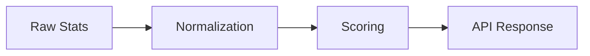
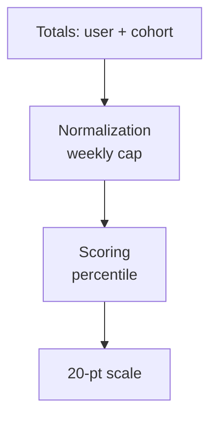
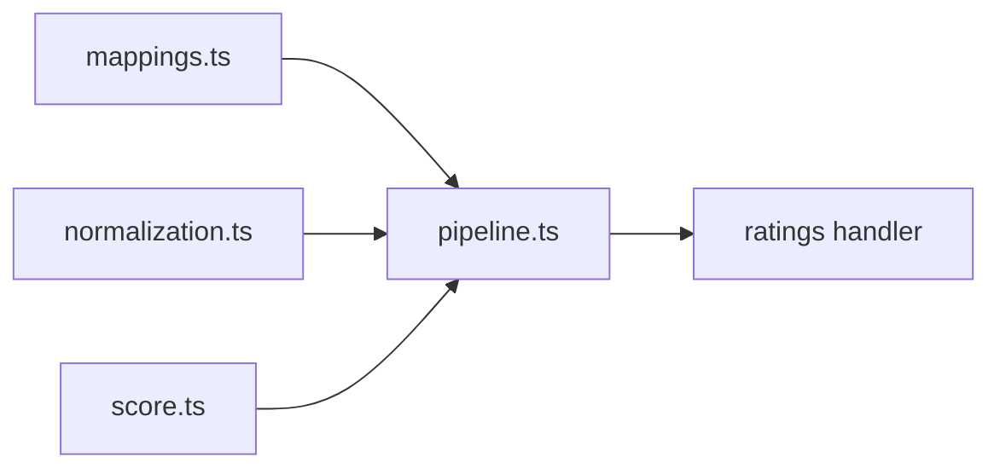

# Rating Architecture

This project models ratings as a simple pipeline. Each stage has a single job
and stays small so math changes (capping, outliers, period windows) remain
localized.

Stages

1. Raw stats
   - Services fetch and cache totals (for example, PR counts).
   - GitHub GraphQL calls live in `server/services/githubApiService.ts`.
   - Cache orchestration lives in `server/services/pullRequestStatsService.ts`.
   - No scoring logic or normalization here.

2. Normalization
   - Convert totals into comparable values.
   - Example: weekly cap of 30 PRs.

3. Scoring
   - Compute percentile or score from normalized values.

4. API composition
   - API handlers compose the pipeline with configuration.
   - Raw totals are mapped for each rating in a dedicated mappings file.
   - Rating settings live in `server/core/ratings/ratings.config.ts`.

Mermaid: data flow

Mermaid: pull request frequency rating

Mermaid: pull request frequency module layout

Notes

- Normalization is the best place to add capping, outlier trimming, and period
  windows.
- Scoring should remain pure math with no IO.
- Services should only gather data and store it.
- IO means any read/write to external systems (GitHub API, database, file
  system, network).
